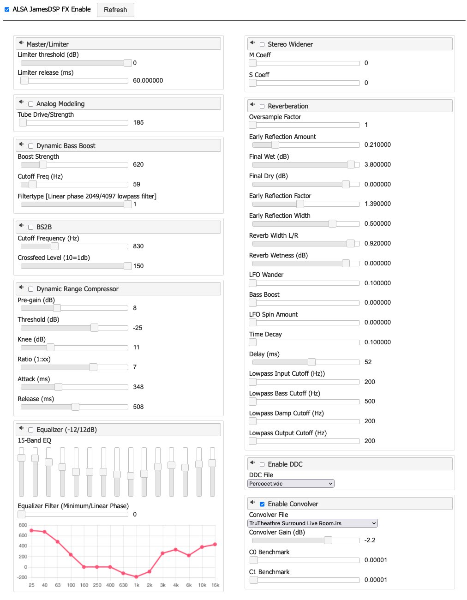

# ALASA JamesDSP GUI

Simple Web UI for [ALSA JamesDSP](https://github.com/faust93/alsa-jamesdsp) plugin
Used to control ALSA JamesDSP properties using web browser

### Install & Run

Meant to be run on the same host where ALSA JamesDSP is installed

```bash
git clone https://github.com/faust93/alsa-jamesdsp-gui
cd alsa-jamesdsp-gui
pip3 install -r requirements.txt

python3 ./jamesdsp-gui.py -d /opt/jdsp/data -p /opt/jdsp/.jdspfx.ctl -c /opt/jdsp/jdspfx.txt
```

Command line options:
```bash
usage: jamesdsp-gui.py [-h] [-d DATA] [-p JDSP_CTL] [-c JDSP_CONFIG] [-P PORT]

ALSA JamesDSP GUI

options:
  -h, --help            show this help message and exit
  -d DATA, --data DATA  A full path to the data folder which cointains 'ddc' and 'convolver' subfolders
  -p JDSP_CTL, --jdsp-ctl JDSP_CTL
                        A full path with the filename to the ALSA JamesDSP control pipe file
  -c JDSP_CONFIG, --jdsp-config JDSP_CONFIG
                        A full path with the filename to the ALSA JamesDSP configuration file
  -P PORT, --port PORT  A port number to listen for HTTP requests (default is 8383)
```

### Screenshot

